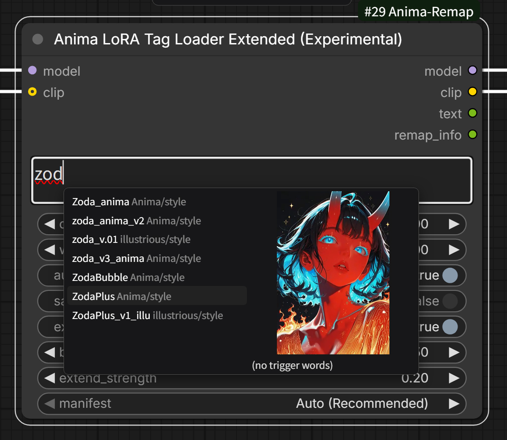
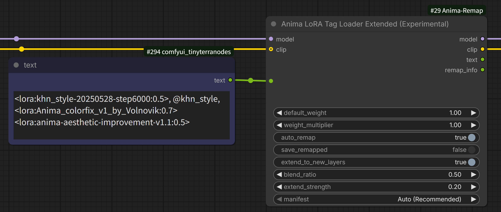

# ComfyUI-Anima-Remap

[English](README.md) | [日本語](README_ja.md)

> **補足（Anima-3.8B v1.1以降について）：** Animaのチェックポイントによっては、Qwen3.5 4B用のcross-attention部分（`semantic_attentions.*`などのconnector関連キー）が、別ファイルのアダプターとしてではなく、DiT本体と同一ファイルに同梱されている場合があります（Anima-3.8B v1.1の"Semantic Connector v2"以降でこの形になりました）。どちらの形で配布されていても、この部分がremap処理の対象になることはありません——検出・remapともに`net.blocks.N`というキーのみを見ており、connector側のキーはこのパターンに一致しないためです。実機確認済み：Qwen3.5を接続しない状態でも、ネイティブのQwen3 0.6B経路のみで生成は問題なく行えます。詳細は下記「Anima-3.8B（52層）対応について」を参照してください。

Anima系モデル(従来Anima/28層、Anima-2.9B/40層、Anima-3.8B/52層、そして今後登場するかもしれない世代)を横断して、LoRA適用・モデルマージ時のレイヤー構造の違いを自動的に吸収するComfyUIカスタムノードパッケージです。どの2世代の組み合わせであっても対応します。Anima専用のランダムLoRAローダー(フォルダ指定、同じ自動リマップ機構を内蔵)も含まれます。

このリポジトリは、更新を停止した[ComfyUI-Anima29B-Remap](https://github.com/shin131002/ComfyUI-Anima29B-Remap)の後継です。ノード内部IDは変更していないので、そちらのリポジトリ向けに作ったワークフローもそのまま読み込めます。

> ⚠️ **このリポジトリと旧`ComfyUI-Anima29B-Remap`を同時にインストールしないでください。** 両パッケージは同じノードIDを登録するため、両方入れているとノード登録が衝突します。移行する場合は、先に旧リポジトリを削除してください。

## これは何のためのツールか

これまでの各Anima世代は、前の世代の各層の間に新規層を挿入する形で拡張されてきました(Animaの28層→Anima-2.9Bの40層→Anima-3.8Bの52層)。このため、旧世代用に作られたLoRAやマージ用モデルをそのまま新しい世代に適用すると、**層のインデックス(番号)がズレて全く別の層に誤って適用されてしまい**、崩れた画像(いわゆる「落書きレベル」の破綻)や、モデルマージ時のノイズ画像の原因になります。

本パッケージは、各層拡張時のインデックス対応情報を記録した`expand_manifest.json`群を使って、どの2世代の組み合わせであっても、このズレを自動検出・補正した上でLoRA適用やモデルマージを行います。

## フォルダ構成

```
ComfyUI-Anima-Remap/
├── LICENSE                                  # コードのライセンス(MIT)
├── README.md                                # 英語版README
├── README_ja.md                             # このファイル(日本語)
├── __init__.py                              # ノード登録
├── mapping/
│   ├── expand_manifest_28_40.json           # 公式のAnima→Anima-2.9Bマニフェスト
│   ├── expand_manifest_40_52.json           # Anima-2.9B→Anima-3.8B(52層)マニフェスト(復元データ、出典は下記参照)
│   ├── expand_manifest_28_52_composed.json  # Anima→Anima-3.8B、上記2つから自動合成
│   └── scripts/
│       └── compose_manifests.py             # メンテナンス用ツール: 隣接世代のmanifestから全ペアを再生成する。ノード実行時には使用しない
├── nodes/
│   ├── __init__.py                          # (空、パッケージ化のため)
│   ├── anima_common.py                      # 共通ロジック(層検出・manifest自動選択・マッピング計算)
│   ├── lora_remap_anima.py                  # LoRAタグローダー(自動リマップ)
│   ├── lora_remap_extended_anima.py         # LoRAタグローダー拡張版(実験的、前後ブレンド)
│   ├── lora_autocomplete_api.py             # LoRA名入力補完のバックエンド(候補一覧・トリガーワード・プレビュー配信)
│   ├── model_merge_anima.py                 # モデルマージ(自動リマップ)
│   ├── model_merge_extended_anima.py        # モデルマージ拡張版(実験的、前後ブレンド)
│   ├── anima_random_lora_loader.py          # ランダムLoRAローダー、3フォルダ版(自動リマップ)
│   └── anima_filtered_random_lora_loader.py # ランダムLoRAローダー、1フォルダ+キーワードフィルタ版(自動リマップ)
└── web/
    └── anima_lora_autocomplete.js           # LoRA名入力補完のフロントエンド(ノード1・3のtext欄)
```

## インストール

このフォルダごと`ComfyUI/custom_nodes/`直下に配置し、ComfyUIを再起動してください。

```
ComfyUI/custom_nodes/ComfyUI-Anima-Remap/
```

またはgit cloneでも配置できます。

```
cd ComfyUI/custom_nodes/
git clone https://github.com/shin131002/ComfyUI-Anima-Remap.git
```

> 旧`ComfyUI-Anima29B-Remap`を既に導入済みの場合は、先にそちらのフォルダを削除してください。両パッケージは同じノードIDを登録するため、両方入れているとノード登録が衝突します。

再起動後、ノード検索(ダブルクリック)で「Anima」と入力すると、以下のノードが見つかります。

- **Anima LoRA Tag Loader (Auto Remap)**
- **Anima Model Merge (Auto Remap)**
- **Anima LoRA Tag Loader Extended (Experimental)** — 実験的機能。詳細は後述
- **Anima Model Merge Extended (Experimental)** — 実験的機能。詳細は後述
- **Anima Random LoRA Loader (28/40/52 Auto)** — フォルダ指定のランダム選択、3グループ。詳細は後述
- **Anima Filtered Random LoRA Loader (28/40/52 Auto)** — フォルダ指定のランダム選択、1フォルダ+キーワードフィルタ。詳細は後述

---

## ノード1: Anima LoRA Tag Loader (Auto Remap)

`<lora:名前:重み>`というタグ構文をプロンプト文字列から解析してLoRAを適用する、LoRA Tag Power Loader系ノードと同じ使い勝手のローダーです。タグごとに、そのLoRA自身のブロック数と接続されたモデルのブロック数を検出し、両者が異なる場合は自動でキー名をリマップしてから適用します。


### 入力

| 名前 | 型 | 説明 |
|---|---|---|
| `model` | MODEL | LoRAを適用するモデル |
| `clip` | CLIP(任意) | LoRAを適用するCLIP |
| `text` | STRING | `<lora:名前:重み>`タグを含むプロンプト文字列 |
| `default_weight` | FLOAT | タグ内で重み省略時のデフォルト値 |
| `weight_multiplier` | FLOAT | 全LoRAの重みに一律で掛ける倍率 |
| `auto_remap` | BOOLEAN | ONで自動リマップ機構を有効化(デフォルトON) |
| `save_remapped` | BOOLEAN | ONで、その場でリマップを行った際に**変換後のLoRAをファイルとしてディスクに保存**する(デフォルトOFF、詳細・注意点は下記) |
| `extend_to_new_layers` | BOOLEAN | 【実験的機能】ONで、新規12層にもLoRAの効果を(近似的に)適用する(デフォルトOFF) |
| `extend_strength` | FLOAT | `extend_to_new_layers`使用時の、新規層への適用強度(タグの重みと掛け算で効く) |
| `manifest` | ドロップダウン | デフォルトの`Auto (Recommended)`は、そのLoRA自身のブロック数と接続モデルのブロック数から、タグごとに正しいmanifestを自動選択します。混在するプロンプト(28層LoRAと40層LoRAを両方参照し、接続モデルが52層、等)でも、それぞれ正しいmanifestが個別に適用されます。特定のファイルを選択すると、検出結果に関わらず全タグでそれを強制します |

### 出力

| 名前 | 型 | 説明 |
|---|---|---|
| `model` | MODEL | LoRA適用後のモデル |
| `clip` | CLIP | LoRA適用後のCLIP |
| `text` | STRING | LoRAタグを取り除いた後のプロンプト文字列(後段のCLIP Text Encoderへ) |
| `remap_info` | STRING | LoRAタグごとに1行で処理結果を出力(キャッシュヒット、`28->52 via <manifest>`、拡張したテンソル数、`applied as-is`など)。テキストオーバーレイやメタデータ埋め込みノードに渡したり、プレビューに繋いで世代混在プロンプトが意図通り解決されたか確認するのに使えます |

### タグ構文

```
1girl, masterpiece <lora:my_old_anima_style:0.8> outdoors
```

`<lora:名前:model重み:clip重み>`のように、clip側の重みを別指定することも可能です(省略時はmodel重みと同じ値)。

#### 名前の照合について

正式な書き方は、フォルダも拡張子も付けない**ファイル名のみ**です。A1111系の構文がこの形で、LoRA Managerの「構文コピー」もこの形式を出力します。この書き方が常に最も確実です。

これに加えて、より緩い書き方も受け付けます。ComfyUI本体のLoRAドロップダウンの表記(相対パス。Windowsでは区切りが`\`)をそのままコピーしても動作します。

| 書き方 | 照合結果 |
|---|---|
| `<lora:mylora:0.8>` | 正式な形。ファイル名のみ |
| `<lora:mylora.safetensors:0.8>` | 拡張子付き |
| `<lora:style/mylora:0.8>` | サブフォルダ付き |
| `<lora:style\mylora.safetensors:0.8>` | Windowsの区切り文字+拡張子 |
| `<lora:STYLE/MyLora:0.8>` | 大文字小文字は区別しない |

サブフォルダを省略した場合に、異なるサブフォルダへ同名ファイルが存在すると、最初に見つかったものが使われ、候補を列挙した警告がログに出ます。特定の1つを指定したい場合はタグにサブフォルダを含めてください。

名前がどうしても一致しなかった場合、警告メッセージにはComfyUIがLoRAフォルダを認識できているか(=名前の問題)、それとも0件と報告しているか(=フォルダ/パス設定の問題)が表示されます。

### LoRA名の入力補完



ノード1・3(Tag Loaderの通常版とExtended版)のtext欄に直接入力している間、LoRAのファイル名を補完できます。

1. ファイル名の一部を**3文字以上**入力すると、部分一致するLoRAの候補一覧が表示されます(大文字小文字は区別しません)
2. `↑`/`↓`キーまたはマウスで候補を選ぶと、右側にプレビューとトリガーワードが表示されます
3. `Enter`/`Tab`/クリックで決定すると、入力途中の文字列が`<lora:ファイル名:1>, トリガーワード`に置き換わります。`Esc`で一覧を閉じます

```
aaa  →  候補から aaabbb を選択  →  <lora:aaabbb:1>, ccc
```

- 候補は「ファイル名の前方一致 → ファイル名の部分一致 → サブフォルダ名の一致」の順に並びます
- 挿入されるのは正式な形(ファイル名のみ)です。同名のファイルが複数のフォルダにある場合だけ、`<lora:char/aaabbb:1>`のようにサブフォルダ付きで挿入します
- 既存の`<lora:...>`の中を編集しているときや、`0.85`のような数値を入力しているときは候補を出しません
- 挿入後のテキストは普通の文字列なので、改行や強度の調整は自由に行えます
- `_animaremap*`キャッシュファイルは候補に出ません
- **text欄に前段のノードを接続している場合は動作しません**(入力欄が無いため)。接続時の動作は従来通りです




#### トリガーワードの取得元

以下の順に探し、最初に見つかったものを使います。

1. `<LoRA名>.metadata.json`(LoRA Manager)の`civitai.trainedWords`
2. `<LoRA名>.civitai.info` / `<LoRA名>.info`(Civitai Helper)の`trainedWords`
3. LoRA本体に埋め込まれた`modelspec.trigger_word`

複数の候補がある場合は、重複を除いてすべて挿入します。学習タグの集計(`ss_tag_frequency`)や学習時の出力名(`ss_output_name`)は、トリガーワードとして明示されたものではないため使用しません。

#### プレビューの取得元

LoRAと同じフォルダにある以下のファイルを、この順で探します。

1. `<LoRA名>.preview.png` / `.webp` / `.jpg` / `.jpeg`(LoRA Manager)
2. `<LoRA名>.png` / `.webp` / `.jpg` / `.jpeg`
3. `<LoRA名>.preview.mp4` / `.preview.webm` / `.mp4` / `.webm`

静止画があればそちらを優先します。動画は無音でループ再生されます。ブラウザがデコードできる形式に限られるため、HEVCのmp4などは表示されない場合があります。

#### 補足

- 候補一覧は30秒間キャッシュされます。LoRAを追加した直後に候補に出ない場合は、少し待ってからtext欄を選択し直してください
- インストール・更新後はComfyUIを再起動した上で、ブラウザをスーパーリロード(`Ctrl+F5`)してください。通常のリロードでは古いJavaScriptがキャッシュから読まれ続けることがあります

### 自動判定のロジック(概要)

各`<lora:名前:重み>`タグごとに、以下を個別に行います。

1. 接続された`model`の総ブロック数を検出(`net.blocks.N`キーの最大値+1、`llm_adapter.blocks`は判定対象から除外)
2. そのLoRAファイル自体が何ブロック分のキーを持つかを同様に検出
3. LoRAの方がモデルよりブロック数が少なければ、その(LoRAのブロック数→モデルのブロック数)の組み合わせに対応するmanifestを解決してリマップする(`manifest`項目参照)。LoRAが既に同等以上のブロック数を持つ場合はそのまま適用する(「上回っている」場合の扱いは下記参照)

タグごとに個別処理されるため、異なるAnima世代のLoRAが混在する1つのプロンプトを同じモデルに適用する場合でも、それぞれのLoRAが自分自身の世代に応じて正しく処理されます(ノード実行全体で1回だけ判定する、という方式ではありません)。

> ⚠️ **LoRAの方が接続モデルより多くの層を参照している場合**(例: Anima-3.8B用に作られたLoRAをAnima-2.9Bモデルに適用しようとした場合)、層数を減らす方向のリマップは不可能です(高いインデックスのテンソルの行き場がありません)。この場合、一致しないテンソルをComfyUIが黙ってスキップして中途半端な適用結果になるのではなく、**エラーを発生させて処理を停止します**。この判定は、キャッシュ利用・その場でのリマップ・そのまま適用のどの経路を通った場合でも、最終的なLoRAに対して行われます。

### リマップ結果のキャッシュ保存(`save_remapped`)について

`save_remapped`は、**リマップ変換後のLoRAをファイルとしてディスクに保存するかどうか**を切り替えるトグルです。保存しておくことで、2回目以降の実行ではリマップ処理そのものをスキップし、保存済みファイルをそのまま読み込むだけで済むようになります。

キャッシュのファイル名には、**リマップ先のブロック数**と、**その結果を生成した設定の短いハッシュ**の両方が埋め込まれます(例: `<名前>_animaremap52_a7f6b0.<拡張子>`)。`manifest`・`extend_to_new_layers`・`extend_strength`を変更するとハッシュも変わるため、古いキャッシュは一致しなくなり、現在の設定で改めてリマップが実行されます。

#### 設定ハッシュに含まれるもの

| 設定 | ハッシュに含まれるか |
|---|---|
| 変換先ブロック数 | 常に含まれる |
| 解決後のmanifestファイル名 | 常に含まれる |
| `extend_to_new_layers` | 常に含まれる |
| `extend_strength` | `extend_to_new_layers`がONのときのみ |
| `blend_ratio`(Extended版) | `extend_to_new_layers`がONのときのみ |

ファイル数を抑えるため、2つの正規化ルールを設けています。

- ハッシュには、ドロップダウンの文字列ではなく**解決後の**manifestファイル名を使います。`manifest`を`Auto (Recommended)`のままにした場合と、Autoが選ぶのと同じファイルを手動で指定した場合は結果が同一なので、キャッシュファイルも共有されます。
- `extend_to_new_layers`がOFFのときは`extend_strength`と`blend_ratio`が結果に影響しないため、ハッシュの対象から完全に外しています。この通常運用のケースでは、それらのスライダーをどう動かしても(LoRA, 変換先, manifest)の組み合わせごとに1ファイルに収束します。

> ⚠️ **注意: `save_remapped`をONにしたまま設定を変え続けると、キャッシュファイルがどんどん増えます。**
>
> 設定の組み合わせごとに別ファイルが生成され、**自動的に削除されることはありません**。調子に乗って`save_remapped`をONのまま何度も設定を変えて実行すると、試した組み合わせの数だけ`_animaremap<N>_<ハッシュ>`ファイルがLoRAフォルダに溜まっていきます。1つあたりのサイズは元のLoRAとほぼ同じです。
>
> `save_remapped`のデフォルトが**OFF**のままなのはこのためで、推奨する運用も従来と変わりません。`save_remapped`はOFFのまま設定を詰め、決まったところで1回だけONにして実行する。溜まってきたら`_animaremap*`ファイルを見渡して、不要なものは削除してください。

> ⚠️ **LoRAを同じファイル名で差し替えた場合、古いキャッシュが使われ続けます。**
>
> ハッシュが対象にしているのはノードの設定であって、元LoRAの中身ではありません。LoRAを再学習して同名で上書きした場合、設定が変わっていなければハッシュも変わらないため、既存のキャッシュファイルが一致してそのまま読み込まれます。古い重みが焼き付いたまま、エラーも警告も出ずに適用されます。**この方法でLoRAを差し替えたときは、対応する`_animaremap*`キャッシュファイルを手動で削除してください。**

#### 旧形式のキャッシュファイルについて

ハッシュ導入以前に書き出されたキャッシュファイル(`<名前>_animaremap52.<拡張子>`、`<名前>_animaremap52_ext.<拡張子>`)は、**読み込まれなくなりました**。どのmanifestや拡張設定で作られたのか判別する手段がなく、それこそがハッシュを導入して解決しようとした問題そのものだからです。検出した場合はファイル名を含む警告をログに出した上で、改めてその場でリマップします。これらのファイルは既に不要なので削除してください。(削除するまでの間も、ノード5・6のフォルダスキャンではキャッシュファイルとして認識され、余分なLoRA候補として拾われることはありません。)

#### 動作の流れ

あるタグについての動作の流れは以下の通りです(そのLoRAがリマップ対象と判定された場合のみ発生します)。

1. **元LoRAのsafetensorsヘッダ(キー名のみ、テンソル本体は読まない)を読み取り**、ブロック数を取得して該当するmanifestを解決し、設定ハッシュを算出する。これにより、重いファイル読み込みをせずにどのキャッシュファイルを探すべきかが決まります
2. **`<元のLoRA名>_animaremap<変換先>_<ハッシュ>.<拡張子>`が存在しないか確認する**(元LoRAと同じ検索方法、サブフォルダを含む)
3. **存在する場合**: そのファイルをそのまま読み込んで適用する。リマップ処理は行わない(=`save_remapped`の設定に関わらず、一致するキャッシュファイルがあれば常にそれが優先される)
4. **存在しない場合**: 元のLoRAを読み込み、その場でキーをリマップして適用する。この時点で`save_remapped`がONなら、結果を上記のハッシュ付きの名前で**元LoRAと同じフォルダに新規保存する**(同名ファイルが既にある場合は上書きせずスキップ)。`save_remapped`がOFFの場合は、適用はするがファイルへの保存は行わない

<details>
<summary>変更前の仕様(設定ハッシュ導入以前) — 参考として残しています</summary>

以下は、ファイル名に設定ハッシュが入る前のキャッシュの挙動についての説明です。**現在は当てはまりません**。変更点を追いやすくするために残してあります。

> ~~キャッシュのファイル名には**リマップ先のブロック数**が埋め込まれます(例: `<名前>_animaremap52.<拡張子>`)。LoRA名だけでなく変換先の世代も含めて区別されるため、40層モデル向けにキャッシュしたファイルを、後で52層モデルに接続した際に誤って再利用してしまうことはありません。(LoRA, 変換先世代)の組み合わせごとに別々のキャッシュファイルになります。~~
>
> ~~⚠️ **注意: `manifest`・`extend_strength`・`extend_to_new_layers`を調整しながら検討している間は、`save_remapped`はOFFのままにしておくことを強くおすすめします。**~~
>
> ~~キャッシュファイルが一度でも保存されると、**その(LoRA, 変換先世代)の組み合わせについては、その後`manifest`・`extend_to_new_layers`・`extend_strength`の値をいくら変更しても、新しい設定は一切反映されません**。既にキャッシュが存在する限り、そのファイルの中身(=保存した瞬間の設定で焼き付けられた結果)がそのまま優先して読み込まれ続けるためです。~~
>
> ~~そのため、おすすめの運用は次の通りです。~~
>
> ~~1. まず`save_remapped`は**OFF**のまま、`manifest`・`extend_to_new_layers`・`extend_strength`をいろいろ試しながら好みの設定を探す(この間は毎回その場でリマップされるだけで、ファイルには保存されません)~~
> ~~2. 設定が決まったら、その時だけ`save_remapped`を**ON**にして1回実行し、確定版のキャッシュファイルを書き出す~~
> ~~3. 設定を変えて試し直したくなったら、生成されたキャッシュファイルを一度削除してから、また1に戻る~~
>
> ~~1. **まず`<元のLoRA名>_animaremap<変換先ブロック数>.<拡張子>`という名前のファイルが、元LoRAと同じ検索方法(同フォルダ/サブフォルダ含む)で既に存在しないか確認する**~~
> ~~2. **存在する場合**: そのファイルをそのまま読み込んで適用する。リマップ処理自体は一切行わない(=`save_remapped`の設定に関わらず、既存のキャッシュファイルがあれば常にそれが優先される)~~
> ~~3. **存在しない場合**: 元のLoRAを読み込み、その場でキーをリマップして適用する。この時点で`save_remapped`がONなら、リマップ結果を`<元のLoRA名>_animaremap<変換先ブロック数>.<拡張子>`として**元LoRAと同じフォルダに新規保存する**(既に他のタイミングで同名ファイルが作られていた場合は上書きせずスキップする)。`save_remapped`がOFFの場合は、適用はするがファイルへの保存は行わない(次回実行時もこの「その場でリマップ」処理を毎回繰り返すことになる)~~
>
> ~~つまり`save_remapped`をONにしておくと、初回実行時に自動生成されたキャッシュファイルが、同じ(LoRA, 変換先世代)の組み合わせについて以降ずっと使われ続けるため、**2回目以降はリマップ処理のオーバーヘッドなしで高速に適用できる**、という仕組みです。~~

</details>

### 注意点

- `llm_adapter.blocks`(6層、これまでの拡張の対象外)は、メインの`net.blocks`とは別構造として扱われ、常にリマップ対象から除外されます
- LoRAのキー命名は「ドット区切り(`net.blocks.N.`)」「kohya形式のアンダースコア区切り(`..._blocks_N_...`)」の2パターンに対応しています。それ以外の命名規則の場合は検出されず、リマップなしでそのまま適用されます
- ノード5・6(ランダムローダー)は`.safetensors`・`.pt`・`.ckpt`を対象にスキャンします

---

## ノード2: Anima Model Merge (Auto Remap)

2つのAnimaモデル(MODEL)を、レイヤー構造の違いを自動吸収しながらマージします。どの2世代の組み合わせでも対応します。


### 入力

| 名前 | 型 | 説明 |
|---|---|---|
| `model_1` | MODEL | マージ元モデル1(上側スロット) |
| `model_2` | MODEL | マージ元モデル2(下側スロット) |
| `merge_ratio` | FLOAT(0.0〜1.0) | `model_1`側の混合比率 |
| `extend_ratio` | FLOAT(0.0〜1.0) | 【実験的機能】新規挿入層にも、コピー元の小さい世代側の層の値を(近似的に)ブレンドする度合い(デフォルト0.0 = 従来通り新規層は大きい世代側のまま) |
| `manifest` | ドロップダウン | デフォルトの`Auto (Recommended)`は、`model_1`/`model_2`の検出ブロック数からmanifestを自動解決します。特定のファイルを選択すると、それを強制します |

### 出力

| 名前 | 型 |
|---|---|
| `model` | MODEL |

### `merge_ratio`の意味

- `1.0` → 出力は`model_1`(上側)100%
- `0.0` → 出力は`model_2`(下側)100%
- `0.5` → 50:50でブレンド

### アーキテクチャに応じた自動切り替え

| 状況 | 出力 |
|---|---|
| 両方とも同じブロック数(同じ世代の派生同士) | そのブロック数のまま、直接マージ(リマップ不要) |
| ブロック数が異なる | **常に大きい方のブロック数で出力**。小さい世代側の重みをリマップした上で、共有部分のみ`merge_ratio`でブレンド。新規挿入層は、`model_1`・`model_2`どちらのスロットに繋がれていても**デフォルトでは常に大きい世代側モデルの値をそのまま使用**(`merge_ratio`の影響を受けない。`extend_ratio`で挙動を変更可能、詳細は下記) |
| ブロック数が異なり、かつその組み合わせに対応するmanifestが無い | リマップなしの直接マージにフォールバックし、警告をログ出力する(アーキテクチャが実際に異なる場合、結果が不正確になる可能性あり) |

### `extend_ratio`について(新規挿入層への拡張、実験的機能)

デフォルト(`extend_ratio = 0.0`)では、新規挿入層は常に大きい世代側モデルの値をそのまま使用し、`merge_ratio`や小さい世代側モデルの影響を一切受けません。

`extend_ratio`を0より大きくすると、解決されたmanifestの`inserted_to_source`(各新規層が初期化時にどの旧層からコピーされたか)を使い、新規層の値に小さい世代側モデルの対応する旧層の値を(リマップした上で)ブレンドします。

```
新規層の最終的な値 = (1 - extend_ratio) × 大きい世代側モデル自身の値 + extend_ratio × 小さい世代側モデルの対応する旧層の値
```

`extend_ratio = 1.0`にすると、新規層についても小さい世代側モデルの(近似的な)値で完全に置き換わります。LoRA側の`extend_to_new_layers`/`extend_strength`と同じ考え方に基づいていますが、こちらは独立した機能で、**「正解」は存在しない近似処理**である点は同様です。

なお、このノードには保存機能がないため(下記参照)、キャッシュファイルを書き出すことは一切なく、LoRA側の`save_remapped`に関する注意点はどれも当てはまりません。マージ結果を保存する際は、その都度明示的に`ModelSave`ノードを実行する必要があるため、意図しない古い設定のファイルを使い続けてしまう心配は基本的にありません。

### バイパス時の挙動

ノードを「Bypass」モードにした場合、ComfyUI標準の挙動により、型が一致する最初の入力(`model_1`、上側)がそのまま出力されます。これは本ノード固有の実装ではなく、ComfyUI自体の標準機能によるものです。

### 保存について

このノード自体には保存機能はありません。マージ結果を保存する場合は、ComfyUI標準の**`ModelSave`**ノード(`advanced/model_merging`カテゴリ)を`model`出力に接続してください。

```
[Anima Model Merge] --MODEL--> [ModelSave]
```

`ModelSave`はUNet(拡散モデル)部分のみを保存します(CLIP/VAEは含まれません)。保存先はデフォルトで`ComfyUI/output`配下になるため、生成用に使う場合は`models/diffusion_models`等へ移動してください。

---

## ノード3・4: Extended (Experimental)版について

`Anima LoRA Tag Loader Extended (Experimental)`と`Anima Model Merge Extended (Experimental)`は、通常版のノード(ノード1・2)を一切変更せず、**別ファイル・別ノードとして追加した実験的なバリエーション**です。通常版はこれまで通りの動作のまま安心して使い続けられます。


### 何が拡張されているか

通常版の`extend_to_new_layers`/`extend_strength`(LoRA)や`extend_ratio`(モデルマージ)は、新規挿入層への適用時、解決されたmanifestの`inserted_to_source`が示す**「直前の旧層」のみ**を情報源としていました。

Extended版では、これを**「直前(前側)」と「直後(後ろ側)」の両方の旧層を、指定した比率でブレンドする**形に一般化しています。

- **LoRA Extended**: `blend_ratio`(0.0〜1.0)を追加。前側の重みが`blend_ratio`、後ろ側の重みが`1 - blend_ratio`
- **Model Merge Extended**: 同じく`blend_ratio`を追加。既存の`extend_ratio`と組み合わせて使います(`extend_ratio`が「大きい世代側自身の値」と「小さい世代側由来のブレンド値」の混合比率、`blend_ratio`がその「小さい世代側由来のブレンド値」自体を前後どちらの層から作るかの比率)

```
新規層への適用値 = 前側(直前の旧層)の値 × blend_ratio + 後側(直後の旧層)の値 × (1 - blend_ratio)
```

**`blend_ratio = 1.0`のとき、後側の寄与が0になるため、通常版(ノード1・2)と数値まで完全に同じ結果になります**(テスト済み)。`blend_ratio`を下げていくと、徐々に「直後の層」の影響が混ざっていきます。

> **端のケースについて:** ブロック列の両端付近に挿入された層は、前後どちらか片方のneighborしか存在しない場合があります(最初の挿入層には「前側」が無く、最後の挿入層には「後側」が無い)。この場合`blend_ratio`は適用されず、**存在する側の唯一のneighborを常に全強度で使用**します。`blend_ratio`が存在しない側を優先する値になっていても、その層への拡張がゼロになってしまうことはありません。

### キャッシュファイルについて

LoRA Extended版のキャッシュファイルは、Extended版であること・変換先のブロック数・設定ハッシュの3つを示すサフィックス(例: `_animaremap52_ext_a7f6b0`)で保存されます。そのため、通常版のキャッシュ(`_animaremap52_<ハッシュ>`)、別の変換先向けのキャッシュ、別の設定で作られたキャッシュのいずれとも衝突しません。`blend_ratio`もこのノードのハッシュに含まれます(`extend_to_new_layers`がONのときのみ。OFFでは結果に影響しないため)。

[リマップ結果のキャッシュ保存(`save_remapped`)について](#リマップ結果のキャッシュ保存save_remappedについて)に書かれている内容は、このノードにもそのまま当てはまります。2つの注意点(`save_remapped`をONにしたまま設定を変え続けるとファイルが増えること、LoRAを同名で差し替えると古いキャッシュが使われ続けること)も同様です。

通常版・Extended版どちらのLoRAノードも、上記と同じ「タグごとのmanifest自動解決」と「層数不一致時は停止する」挙動を共有しています。接続モデルより多い層を参照するLoRAは縮小方向にリマップできないため、部分的に適用してしまうのではなくエラーを出して停止します。

### 位置づけ

あくまで実験目的の追加ノードです。「新規層への適用方法をもう少し細かく制御したい」と感じた時に使うもので、通常版だけで十分な場合は無理に使う必要はありません。

---

## ノード5・6: Anima Random LoRA Loader / Anima Filtered Random LoRA Loader (28/40/52 Auto)

[shin131002/RandomLoRALoader](https://github.com/shin131002/RandomLoRALoader)の「Random LoRA Loader」(3フォルダ同時選択)と「Filtered Random LoRA Loader」(1フォルダ+キーワードフィルタ)をAnima専用に移植したノードです。ノード1〜4と同じ自動リマップ機構をそのまま内蔵しており、ランダムに選ばれたLoRAごとに必要であれば自動でリマップしてから適用します。タグを手打ちする必要はありません。


**Anima Random LoRA Loader**は最大3フォルダ(例: スタイル/キャラクター/コンセプト)から同時に選択し、フォルダごとに強度範囲・選択数を設定できます。**Anima Filtered Random LoRA Loader**は単一フォルダ+キーワードフィルタ(AND/OR、フレーズ一致、メタデータ検索オプション)構成で、大規模で雑多なLoRAコレクションに向いています。

トリガーワード抽出・プレビュー画像出力・強度のランダム範囲指定(`"0.4-0.8"`等)は、元のRandomLoRALoaderパッケージと同じ仕様です。これらの詳細は元プロジェクトのREADMEを参照してください。

### 元のRandomLoRALoaderとの違い

- **Anima専用です。** SD1.5/SDXL/Flux等の汎用ローダーではありません。それらは[RandomLoRALoader](https://github.com/shin131002/RandomLoRALoader)を使ってください
- **LoRA Block Weight(LBW)は非対応です。** AnimaのフラットなTransformerブロック構造は、LBWが前提とするSD1.5/SDXL特有のIN/MID/OUTプリセットの考え方をそのまま適用できないため、現時点では対象外としています
- **`save_remapped`(ディスクへのリマップキャッシュ保存)は非搭載です。** これらのノードは実行のたびに異なるLoRAを選ぶ使い方が前提のため、キャッシュファイルは`manifest`/`extend_to_new_layers`/`blend_ratio`/`extend_strength`のいずれかを変更した瞬間に気づかれずに古くなってしまいますし、フォルダスキャン時にメタデータの無い「もう1つのLoRA候補」として再検出されてしまう問題もあります。そのため毎回その場でメモリ上のみでリマップします。LoRAファイル自体は小さいため、生成処理全体から見ればこの追加コストは無視できる範囲です
- **フォルダスキャンはシンボリックリンクを辿ります。** ComfyUI本体のフォルダスキャンと同じ挙動です。サブフォルダがシンボリックリンクの場合もその中まで検索するため、リンク先にしか存在しないLoRAも、ComfyUIネイティブのドロップダウンと同様に候補に含まれます。リンクが循環している場合は検出してスキップするので、スキャンが止まることはありません
- **フォルダスキャン時に、ノード1〜4が書き出す`_animaremap<N>`・`_animaremap<N>_ext`形式のキャッシュファイルを除外します。** 現在のハッシュ付き形式(`_animaremap52_a7f6b0`)と、ハッシュ導入以前の旧形式(`_animaremap52`)の両方に対応しています。ノード1〜4を`save_remapped`ONで同じLoRAフォルダに対して使っていた場合、それらのキャッシュコピーは余分な候補として拾われず、自動的にスキップされます
- **リマップ関連設定はフォルダ/グループ単位ではなく共通1セットです。** `auto_remap`・`manifest`・`extend_to_new_layers`・`blend_ratio`・`extend_strength`は、ノード全体で共通の設定が使われます。ただし**実際に適用されるmanifestはLoRAごとに解決されます**。28層LoRAと40層LoRAが混在するフォルダを52層モデルに対して使う場合でも、`manifest`が`Auto`のままなら、それぞれ正しいmanifestで個別にリマップされます
- **層数不一致時に停止する挙動はノード1〜4と共通です。** ランダムに選ばれたLoRAが接続モデルより多い層を参照していた場合、部分的な適用にはせず、エラーを出して停止します

### 入力(Random LoRA Loader、3フォルダグループ版)

| 名前 | 型 | 説明 |
|---|---|---|
| `model` / `clip` | MODEL / CLIP | ベースのモデル/CLIP |
| `additional_prompt_positive` / `_negative` | STRING | 追加プロンプト。選択された各LoRAのトリガーワードと結合される |
| `lora_folder_path_1..3` | STRING | グループごとのフォルダパス |
| `include_subfolders_1..3` | BOOLEAN | サブフォルダを含めるか |
| `unique_by_filename_1..3` | BOOLEAN | サブフォルダ間の同名ファイルを除外 |
| `model_strength_1..3` / `clip_strength_1..3` | STRING | 固定値(`"1.0"`)またはランダム範囲(`"0.4-0.8"`) |
| `num_loras_1..3` | INT | グループごとの選択数 |
| `trigger_word_source` | ドロップダウン | `json_combined`/`json_random`/`json_sample_prompt`/`metadata` |
| `seed` | INT | ランダム選択のシード値 |
| `auto_remap` | BOOLEAN | ノード全体で共通(デフォルトON) |
| `extend_to_new_layers` | BOOLEAN | 【実験的機能】ノード全体で共通(デフォルトOFF) |
| `blend_ratio` | FLOAT | ノード全体で共通(デフォルト1.0) |
| `extend_strength` | FLOAT | ノード全体で共通(デフォルト0.5) |
| `manifest` | ドロップダウン | デフォルトの`Auto (Recommended)`は、選択された各LoRAごとにmanifestを自動解決します。特定のファイルを選択すると、全LoRAでそれを強制します |

### 入力(Filtered Random LoRA Loader)

3つのフォルダグループの代わりに、1フォルダ+キーワードフィルタになっています。ここに記載のない項目は上の表と同じです。

| 名前 | 型 | 説明 |
|---|---|---|
| `lora_folder_path` | STRING | 選択対象となる単一のフォルダ |
| `include_subfolders` | BOOLEAN | サブフォルダも再帰的に検索する(デフォルトON) |
| `unique_by_filename` | BOOLEAN | サブフォルダ間で重複するファイル名を除外する(デフォルトON) |
| `keyword_filter` | STRING | スペース区切りのキーワード。複数語のフレーズはダブルクォートで囲む(`"anime style" red`)。空欄ならフィルタなし |
| `filter_mode` | ドロップダウン | `AND`(デフォルト)は全キーワードに一致するもの、`OR`はいずれか1つに一致するもの |
| `search_in_metadata` | BOOLEAN | ファイル名だけでなく、各LoRAファイルのメタデータ内も検索する(デフォルトOFF)。大きなフォルダでは全ファイルのヘッダを読む必要があるため初回スキャンが大幅に遅くなる。2回目以降はノードインスタンスごとにキャッシュされる |
| `model_strength` / `clip_strength` | STRING | 固定値(`"1.0"`)またはランダム範囲(`"0.4-0.8"`) |
| `num_loras` | INT | 選択するLoRAの数(0〜20) |


### 出力

元のRandomLoRALoaderノードと同じ構成です: `MODEL`、`CLIP`、`positive_text`、`negative_text`、`positive`(CONDITIONING)、`negative`(CONDITIONING)、`preview`(IMAGE)。`positive_text`には選択された各LoRAが`<lora:名前:model強度:clip強度>, トリガーワード`の形式で含まれます(CONDITIONING出力に渡す前にLoRA構文は除去されます)。

---

## Anima-3.8B(52層)対応について

[lylogummy/Anima-3.8B](https://huggingface.co/lylogummy/Anima-3.8B)(52層)は、Anima-2.9Bをコミュニティが52ブロック(既存40ブロック+新規学習12ブロック)まで拡張したモデルで、プロンプト理解力向上のためのQwen3.5 4B cross-attentionコンポーネント(オプション)と対になっています。このコンポーネントはリリースによって、別ファイルのアダプターとして配布される場合(初期のpreview版)と、DiT本体のチェックポイントに同梱される場合(Anima-3.8B v1.1の"Semantic Connector v2"以降)があり、この配布形態は既に一度変わっており、今後さらに変わる可能性もあります。本パッケージが扱うのは52層チェックポイントの**DiTブロック構造のみ**です。どちらの形で配布されていても、Qwen3.5コンポーネントは独立した追加キー群(`semantic_attentions.*`など、どの`net.blocks.N`パターンにも一致しない関連キー)であり、リマップ処理は一切関与しません——検出・リマップともに`net.blocks.N`というキーのみを見ています。従来40層Anima-2.9BのDiT向けに作られたLoRA・マージ用モデルは、これまでのAnima-2.9B向けリマップと全く同じ考え方で52層のDiTにリマップされます。実機確認済み：Qwen3.5を完全に未接続にしても(ネイティブのQwen3 0.6B経路のみ)、生成は問題なく行えます。

> **出典について:** 公式のAnima→Anima-2.9B用`expand_manifest.json`とは異なり、Anima-2.9B→Anima-3.8Bの拡張については公式の対応表が公開されていません。`mapping/expand_manifest_40_52.json`は、`anima38B_base.safetensors`とAnima-2.9Bチェックポイントをブロック単位で比較(`self_attn.q_proj.weight`と`mlp.layer1.weight`のコサイン類似度、相互にクロスチェック済み)することで復元したものです。これはLLaMA Pro方式に典型的な「隣接ブロックをコピーしてから追加学習する」という初期化パターンを検出する手法です。今後公式の対応表が公開された場合はこのファイルを差し替え、`mapping/expand_manifest_28_52_composed.json`も再生成してください(下記参照)。

### ⚠️ テキストエンコーダーに関する留意点(Qwen3.5 4B)

本パッケージのリマップ処理が扱うのは**DiTのブロック構造のみ**です。接続するテキストエンコーダー経路が生成結果にどう影響するかには一切関与しません。これはブロックリマップとは完全に独立した軸の話ですが、Anima-3.8B特有の事情でここに明記しておく価値があると判断しました。

- **「Qwen3.5 4B adapterがそもそも機能するか」はブロック数(世代)の話であり、全世代で同じように機能します。** adapterが注入する先は、Animaの標準的なブロックテンプレートが元から持っている`cross_attn`スロットです。このスロットはAnima-3.8Bより前から存在し、ブロックリマップの有無によっても変わりません。52層に限った話ではなく、28層・40層でも同じように機能します。
- **「結果の良し悪し」は、ブロック数とは無関係な、テキストエンコーダー自体の特性の話です。** Qwen3.5 4Bは、Anima/Anima-2.9B用LoRAが本来学習時に前提としていたQwen3 0.6Bと比べて、格段に能力の高い言語モデルで、指示追従性もずっと強いです。あるLoRAやプロンプトがテキストエンコーダーを切り替えた際にどこまで通用するかを左右するのは、この能力差であって、「どの世代のDiTに繋いでいるか」ではありません。

これはLoRAがそもそもブロックリマップを必要としていたかどうかとは無関係です。ここで触れているのは、Anima-3.8Bがこのモデル系列で初めて「テキストエンコーダーを追加で選べる」世代になったことで、この区別が初めて意味を持つようになったからです。

## `expand_manifest.json`と複数世代対応について

`mapping/`内の各ファイルは、1つのAnima拡張ステップにおけるブロックインデックスの対応情報を記録しています(`old_block_count`、`new_block_count`、`insertion_positions`、そして各新規層が初期化時にどの旧層からコピーされたかを示す`inserted_to_source`)。各ノードの`manifest`ドロップダウンはデフォルトで`Auto (Recommended)`になっており、実際に扱っているLoRA/モデルのペアの`(old_block_count, new_block_count)`に一致するmanifestを自動選択するため、通常この項目を意識する必要はありません。

`mapping/expand_manifest_28_52_composed.json`は手作業で作ったものではなく、`mapping/scripts/compose_manifests.py`によって28→40と40→52のmanifestから機械的に合成されています。これにより、28層LoRAを52層モデルに1段階で直接リマップでき、ノード側に複雑な連鎖処理を持たせる必要がありません。

将来、新しいAnima世代が独自のブロック拡張とともに登場した場合:

1. その世代のmanifest(公式のものがあればそれを、無ければ同様の比較手法で復元したものを)`expand_manifest_<旧>_<新>.json`として`mapping/`に追加する
2. `python mapping/scripts/compose_manifests.py auto mapping/`を実行し、既存のmanifestとの新たな組み合わせを全て再生成する
3. それ以外は何も変更不要です。`Auto`により、全ノードが新しいmanifestを自動的に使うようになります

## 既知の制約

- 公式に公開されているブロック対応表は、従来Anima→Anima-2.9Bの拡張についてのみです。それ以降(現時点では→Anima-3.8B/52層)は復元データに依存します。詳細は上記の出典についての注記を参照してください
- LoRAのキー命名規則が想定外のパターンの場合、自動検出に失敗しリマップされません
- **世代の自動判定は、LoRAのキーが実際に参照している最大ブロック番号に基づいており、ファイルに埋め込まれたラベルを見ているわけではありません。** そのため、後の世代用に学習されたLoRAでも、前半〜中盤のブロックしか触っていない(例: 構造専用LoRA)場合は、誤って前の世代用と判定されリマップされてしまう可能性があります。現時点では特定の`manifest`ファイルを手動で強制する以外の上書き手段は用意していません。実運用で問題になるようであれば、「特定世代を強制」といった専用オプションの追加を検討します
- モデルマージは`comfy.model_patcher.ModelPatcher`の`get_key_patches`/`add_patches`(ComfyUI標準のマージ機構と同じ仕組み)を利用しています

## ライセンスについて

Anima(base)・Anima-2.9B・Anima-3.8B(52層)は、いずれも**CircleStone Labs Non-Commercial License**の下で提供されています(Anima-3.8Bのモデルカード自体に、元のAnima-base/Anima-2.9Bのライセンスに従う旨が明記されています)。本パッケージ(LoRA Remap / Model Mergeノード)を使って生成される、リマップ後のLoRAファイルやマージ後のモデルファイルは、対象がどの世代であっても、いずれもこのライセンスにおける「Derivative(派生物)」に該当するため、**同じ非商用制限が引き継がれます**。

- モデル本体・その派生物(今回のリマップ済みLoRA、マージ済みモデルを含む)は、非商用目的でのみ使用可能です
- 一方で、これらのモデルを使って**生成した画像(Outputs)自体は商用利用が可能**です(ライセンス上、生成画像は「Derivative」の定義から明示的に除外されています)
- Animaはさらに`Cosmos-Predict2-2B-Text2Image`の派生モデルにも該当するため、その範囲でNVIDIA Open Model License Agreementの条件も付随します
- ライセンス上、個人が「重みファイル(モデルやLoRA)そのもの」を有償配布すること自体は例外的に認められていますが(第2.c項)、それを組み込んだ製品・サービス・ツールとしての提供は対象外で、別途通常の商用ライセンスが必要です
- Anima-3.8Bに付随する別コンポーネントのQwen3.5 4Bテキストエンコーダー自体はApache 2.0です(このサイズ帯のQwenモデルの一般的なライセンスと同様)。本パッケージはこのファイルを一切処理・再配布しないため制約には関与しませんが、参考情報として付記しておきます

本ツールは個人利用・非商用での使用を前提としています。商用利用や配布を検討する場合は、必ず一次情報である`LICENSE.md`(Hugging Face上のAnimaリポジトリに同梱)や各モデルページのライセンス記載を確認するか、専門家に相談してください。本READMEの記載は法的助言ではありません。

なお、このライセンス制約は**Animaのモデル重み自体(および、それを使って作られたリマップ済みLoRA・マージ済みモデル)に適用されるもの**であり、本リポジトリの**コード自体(ノードのPython実装)はMITライセンス**(同梱の`LICENSE`ファイル参照)の下で公開しています。

## 免責事項とサポートポリシー

### 免責事項

- このノードは**技術サポートなし**で提供されます
- 機能の保証はありません
- 将来のComfyUIアップデートとの互換性は保証されません
- バグレポートや機能リクエストに対応しない場合があります
- 自己責任で使用してください

### サポート状況

- ❌ issueやメールでの個別サポートなし
- ❌ バグ修正や機能追加の保証なし
- ✅ コードはオープンソース - 自由にフォーク・修正可能
- ✅ コミュニティディスカッション歓迎(返答の約束なし)

### 問題の報告

サポートは保証されませんが、以下が可能です:
1. リポジトリの既存issueを確認
2. このREADMEとトラブルシューティングセクションを確認
3. issueを開く(対応されない場合があります)
4. 自分でフォークして修正

## ライセンス

MIT License - 自由に使用、変更、配布できます。

ただし前述の通り、Animaモデル自体(重み、およびそこから作られるLoRA・マージ済みモデル)は別途CircleStone Labs Non-Commercial Licenseの制約を受けます。
